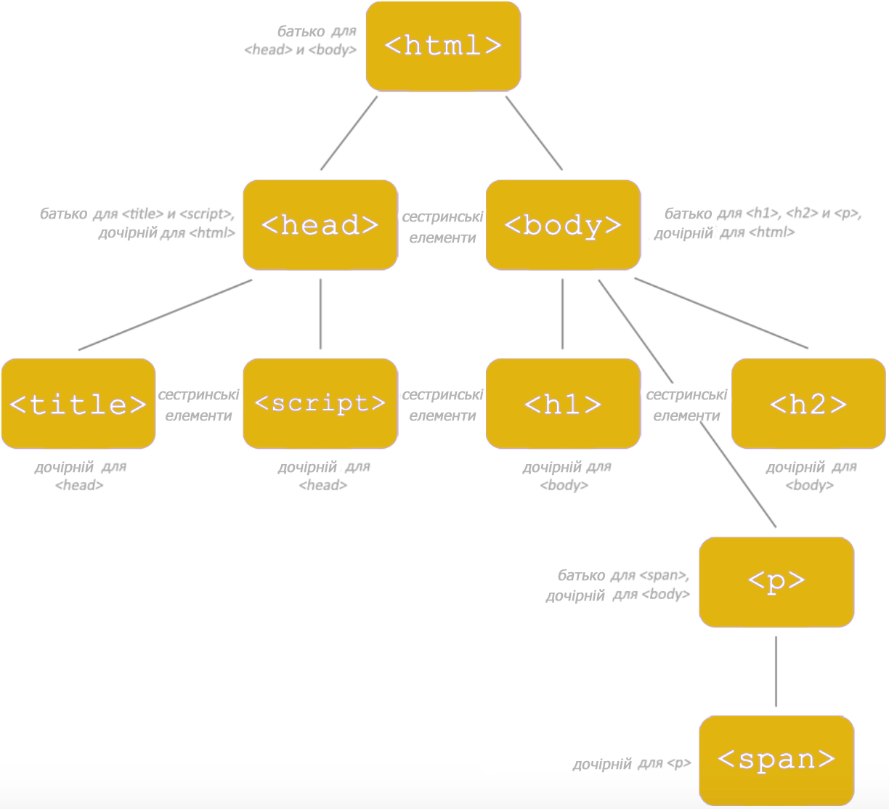
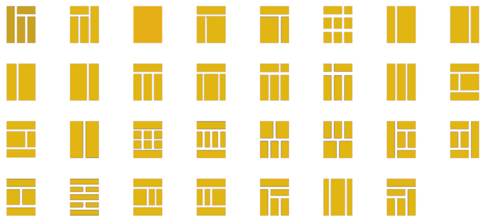

# Урок 3. Семантична розмітка сторінки

### Мета:

* навчити писати семантичну розмітку html сторінок;
* учні мають уміти аналізувати дизайн-макет та по ньому планувати розмітку;
* виховати відповідальне ставлення до семантики з перших кроків у фронтенді.


#### Мотивація для студентів

Тут можна показати слайд про те, скільки коштує на виході чистий семантичний код, на відміну від невалідного. Розповісти, що важливо одразу вчитися писати код правильно.

#### Структура HTML документу (15 хв)

Давайте розберемо, з чого складається найпростіший html документ

```text
<!-- Оголошення формату/типу документу --> 
<!DOCTYPE html>   
<html>
<head>
    <!-- Визначаємо систему кодування символів --> 
    <meta charset="utf-8">
    
    <!-- Встановлюмо параметри відображення сторінки на мобільних пристроях -->
    <meta name="viewport" content="width=device-width, initial-scale=1.0">
    
    <!-- Даємо заголовок сторінки --> 	 
    <title>Title</title> 
    
    <!-- Підключаємо зовнішню таблицю стилів --> 	 
    <link media="all" rel="stylesheet" href="css/main.css">
    
    <!-- Підключаємо скрипти -->
    <script src="js/main.js"></script>
</head> 

<body>
    <!-- Основна частина документу -->
    
    <header>"Шапка" сайту</header>
	
    <main>Основний контент</main>
    
    <footer>"Підвал" сторінки</footer>
    
</body>
</html>
```

`<html> ... </html>` - обов'язковий тег, що вміщує всю структуру сторінки

`<head> ... </head>` - призначений для збереження службової інформації для браузера та пошукових систем

`<body> ... </body>` - "тіло" сторінки, в якому зберігається весь контент сторінки

В середині шапки сайту часто розміщується навігаційне меню. Для його визначення використовується тег `<nav>`, в середині якого саме меню створюється за допомогою маркованого списку. Елементи списку виступають пунктами меню. Схоже меню часто зустрічається і в підвалі сайту \(у футері\).

```text
<header>
    <nav>
        <ul>
            <li>Пугкт меню 1</li>
            <li>Пугкт меню 2</li>
            <li>Пугкт меню 3</li>
            <li>Пугкт меню 4</li>
            <li>Пугкт меню 5</li>
        </ul>
    </nav>
</header>
```

В основному контенті, всередині тега `<main>` можуть бути різні смислові блоки, в залежності від завдань проекту. Наприклад, односторінкові сайти \(лендінги\) складаються із секцій, блоги наповнені статтями, в інтернет-магазинів часто присутні бокові колонки. Для всіх них в HTM5 існують окремі теги. Всі вони ведуть парні та блочні. 

#### Семантичні теги для групування контенту: (5 хв)

* `<section>` - створює секцію, яка передбачає наявність заголовка;
* `<aside>` - створює бокову колонку сайту \(часто називається - сайдбар\). Таких колонок може бути декілька на одній сторінці і розрізняються вони класами;
* `<article>` - створює статтю. В ній може бути присутня інформація про автора - `<author>`, дата публікації - `<date>` або `<datetime>`, заголовок та ін;

#### Заголовки. (15 хв)

В специфікації мови HTML5 існує шість рівнів заголовків - від 1\(найголовніший\) до шостого. Приклад написання заголовків різного рівня.

```text
<h1>Заголовок 1 рівня</h1>
<h2>Заголовок 2 рівня</h2>
<h3>Заголовок 3 рівня</h3>
<h4>Заголовок 4 рівня</h4>
<h5>Заголовок 5 рівня</h5>
<h6>Заголовок 6 рівня</h6>
```


Важливо пам'ятати, що згідно із правилами семантичного коду на одній сторінці сайту заголовок першого рівня можна використовувати один раз.


Інші заголовки можна використовувати скільки завгодно разів, але варто дотримуватися їх ієрархії.

#### Взаємовідносини між тегами: батьківський, дочірній, сестринський, сусідній (15 хв)



Варто вчителю разом із учнями розібрати представлену схему!

#### Коментарі (5 хв)

Коментар в HTML-коді задається так:

`<!-- будь-який текст чи код -->`

Текст всередині коментаря не відображається браузером на сторінці.

Коментарі зазвичай використовуються в наступних випадках: 

1. Для коментування коду. Завжди корисно залишити підказку.
2. Для тимчасового відключення коду. Видаляти код незручно, так як його треба буде відновлювати, а закоментувати і потім розкоментувати — найкраще рішення.

Коментарі можна використовувати в будь — якому місці сторінки, крім тега - всередині нього вони не працюють.

#### Layout веб-сторінки. Розбираємо макет майбутнього сайту (30 хв)

Існує багато версій макетів сайту. І їх розмаїття закінчується там, куди сягає ваша фантазія, або фантазія дизайнера!



Вчитель разом із учнями обирає декілька макетів і верстають іх в редакторі коду. Вчитель показує свій екран, пише код та ОБОВ'ЯЗКОВО коментує використання кожного елементу. Окрім власних коментарів вже час запитати учнів, який тег вони б використали в тому чи іншому випадку.


Варто звернути увагу на вкладеність тегів. Код має бути структурованим.


#### Стандарти верстки. Валідація. (10 хв)

Всі технології підпорядковуються певним стандартам та правилам. Це стосується й HTML.

**Валідна верстка** - це верстка, яка зроблена за всіма стандартами W3C \(www consortium\). Тобто верстку можна вважати валідною лише тоді, коли вона буде відповідати встановленим W3C стандартам.

#### Переваги валідної верстки

* Перша перевага - **кроссбраузерність**. Цим поняттям позначають правильне і однакове відображення верстки у всіх популярних браузерах. В першу чергу це: Opera, Chrome, Mozilla FireFox, Safari, а так само Internet Explorer \(куди ж без нього\)\) \). Завдяки тому, що браузери постійно вносять коригування в свої продукти щодо вимог Всесвітнього веб консорціуму. Звідси випливає що валідність стає синонімом кросбраузерності.
* Другий плюс валідної верстки - пошукові системи. Вони, так само як і браузери, відстежують стандарти і використовуючи їх вносять коригування в пошукову видачу. Варто відразу помітити, що бувають і винятки у ПС, але в основній масі валідна верстка все-таки грає роль в ранжируванні \(незважаючи на те, що у самих пошуковиків в районі сотні помилок у валідації\). 

#### Як перевірити валідність \(правильність\) верстки?

Все досить просто! Щоб з'ясувати наскільки правильна ваша верстка досить зайти на сайт validator.w3.org і там перевірити хоч за посиланням на сайт, хоч завантаживши файл сторінки і навіть скопіювавши код у вікно на сайті.


Валідація HTML - [https://validator.w3.org/](https://validator.w3.org/)


### Узагальнення та систематизація знань (10 хв)

* Яка базова структура html сторінки?
* За що відповідає елемент `<head>`?
* Як можна розрізняти бокові колонки, якщо їх декілька на одній сторінці?
* На прикладі коду, що на екрані, назвіть батьківські, дочірні та сестринські елементи.
* Коли саме варто використовувати коментарі?
* Поясніть поняття кросбраузерності.

### Домашнє завдання

Обрати будь-який макет сайту із запропонованих та написати його розмітку із дотриманням семантики коду.

